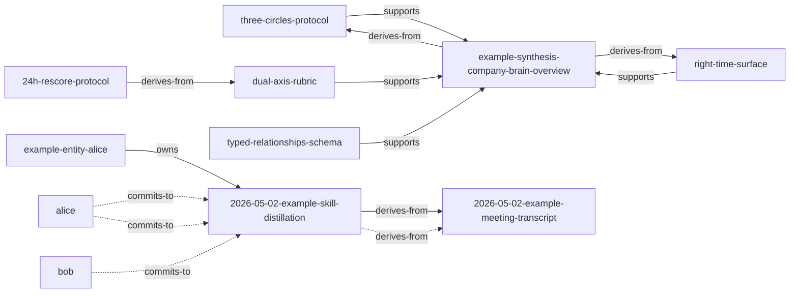

# Sample runs · captured 2026-06-12 (v0.5.0)

> Captured from a clean working tree running on the bundled `examples/wiki` vault. Re-recorded for v0.5.0 (the 2026-05-02 originals had drifted: freshness binning logic evolved and stats gained the active/candidate split). CI re-runs the first three on every push.

## relationship_graph.py --stats

```
# G2 typed edges · 图统计

- 边数：13（active 13 · candidate 0）
- 节点数：11

## 按类型分布
- `commits-to`: 3
- `owns`: 1
- `derives-from`: 5
- `supports`: 4

## 按来源分布
- explicit: 9
- derived-from-decision: 4
```

## wiki_lint_l10.py

```
# wiki-lint L10 · typed-relationships schema 验证

- 错误（hard errors）：**0**
- 警告（warnings）：**0**

✅ 全部 typed relationships 通过 schema 验证。
```

## metacognition_signals.py

```
# Metacognition Signals · Phase 5 v0.1

> 信号：✅ stale / ✅ orphan / ✅ freshness / ✅ weak-evidence（OSA 卡） · ⏳ conflict（v0.2）

## 🌱 freshness (1)

- ℹ️ `(global)` — freshness 分布（按 mtime）：fresh=0 aging=8 stale=0

## 🚨 orphan (2)

- ⚠️ `decisions/2026-05-02-example-skill-distillation.md` — commitment #1 due 2026-05-02 EOD 已过但未标 low confidence：Write SKILL.md + 5 references + parameterize 5 scripts + bun
- ⚠️ `decisions/2026-05-02-example-skill-distillation.md` — commitment #2 due 2026-05-02 已过但未标 low confidence：Review the public-facing positioning before push

```

## brain_surface.py · topic 'company brain right-time surface'

```
## Brain Surface · topic: `company brain right-time surface` · role: `self`

_Visible circles: ['individual', 'institutional', 'raw', 'shared', 'tooling', 'unknown']_

### 🧠 Concepts (semantic layer) (5)

- `concepts/right-time-surface.md` - Right-time surface - 2026-04-20 ·claude-auto
  > > A Company Brain shows up **at the moment of work**, not when the user remembers to search.
- `concepts/three-circles-protocol.md` - Three-circles protocol - 2026-04-22 ·claude-auto
  > > `personal ≠ shared ≠ company record` — and the boundary between them must be **explicit**, not assumed.
- `concepts/typed-relationships-schema.md` - Typed relationships schema (mini) - 2026-04-25 ·claude-auto
  > Plain wikilinks are platonic — they say "these two notes are connected" without saying *how*. A Company Brain needs the 
- `concepts/dual-axis-rubric.md` - Dual-axis maturity rubric - 2026-05-02 ·claude-auto
  > | Right-time surface frequency | ≥ 3 triggers/week | 1-2 | 0 |
- `concepts/24h-rescore-protocol.md` - 24-hour re-score protocol - 2026-05-02 ·claude-auto
  > 1. **Lock the timestamp** when you say "done". Record the artifact list and metric values claimed.

### Syntheses (institutional) (1)

- `syntheses/example-synthesis-company-brain-overview.md` - Company Brain overview (synthesis) - 2026-04-30 ·claude-auto
  > > A synthesis page demonstrating how four pillars combine into one Company Brain. This is an **example** for the skill's

### Decisions md (4-tuple) (1)

- `decisions/2026-05-02-example-skill-distillation.md` - Example decision: distill Company Brain into a public skill - 2026-05-02
  > **Final decision**: Distill the Company Brain stack into a public skill (Option C — full skill including parameterized s

### Transcripts / raw notes (1)

- `sources/transcripts/2026-05-02-example-meeting-transcript.md` - Example meeting transcript - 2026-05-02
  > **alice**: So I want to talk about the Company Brain stack we built. The methodology is the asset, not the data. If we k

```

## brain_surface.py · same vault, role=student (institutional+shared only)

```
## Brain Surface · topic: `circle protocol` · role: `student`

_Visible circles: ['institutional', 'shared']_

### 🧠 Concepts (semantic layer) (5)

- `concepts/three-circles-protocol.md` - Three-circles protocol - 2026-04-22 ·claude-auto
  > Iron rule: a piece of content lives in exactly one circle at a time. The circle field declares it.
- `concepts/24h-rescore-protocol.md` - 24-hour re-score protocol - 2026-05-02 ·claude-auto
  > Without the protocol, the optimistic 40+ would have stuck. The gap came from:
- `concepts/typed-relationships-schema.md` - Typed relationships schema (mini) - 2026-04-25 ·claude-auto
  > > The minimal version. The full normative spec is in `references/typed-relationships-schema.md`.
- `concepts/right-time-surface.md` - Right-time surface - 2026-04-20 ·claude-auto
  > > A Company Brain shows up **at the moment of work**, not when the user remembers to search.
- `concepts/dual-axis-rubric.md` - Dual-axis maturity rubric - 2026-05-02 ·claude-auto
  > > Reporting "system maturity = 54/60" hides the gap between **scaffold built** and **actually being used**. Split into t

### Syntheses (institutional) (1)

- `syntheses/example-synthesis-company-brain-overview.md` - Company Brain overview (synthesis) - 2026-04-30 ·claude-auto
  > | 2 | Three-circle promotion gate | `circle:` frontmatter on 5-10 high-traffic notes |

### Decisions md (4-tuple) (1)

- `decisions/2026-05-02-example-skill-distillation.md` - Example decision: distill Company Brain into a public skill - 2026-05-02
  > **Final decision**: Distill the Company Brain stack into a public skill (Option C — full skill including parameterized s

```

## relationship_graph.py --mermaid


```
