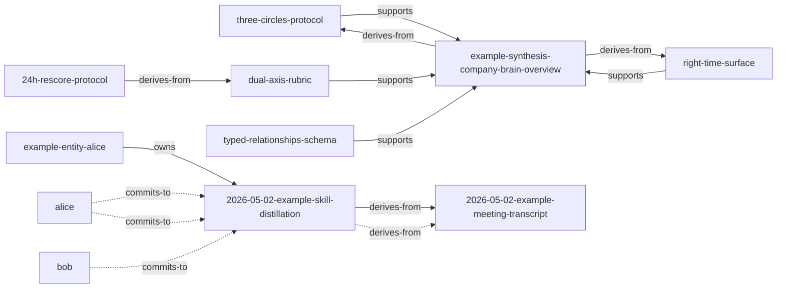

# Sample runs · captured 2026-05-02

> Captured from a clean clone running on the bundled `examples/wiki` vault. These outputs are the field-test evidence backing the README's claims.

## relationship_graph.py --stats

```
# G2 typed edges · 图统计

- 边数：13
- 节点数：11

## 按类型分布
- `commits-to`: 3
- `owns`: 1
- `derives-from`: 5
- `supports`: 4

## 按来源分布
- explicit: 9
- derived-from-decision: 4
```

## wiki_lint_l10.py

```
# wiki-lint L10 · typed-relationships schema 验证

- 错误（hard errors）：**0**
- 警告（warnings）：**0**

✅ 全部 typed relationships 通过 schema 验证。
```

## metacognition_signals.py

```
# Metacognition Signals · Phase 5 v0.1

> 5 信号实现：✅ stale / ✅ orphan / ✅ freshness · ⏳ conflict / ⏳ weak-evidence（v0.2）

## 🌱 freshness (1)

- ℹ️ `(global)` — freshness 分布（按 mtime）：fresh=8 aging=0 stale=0

```

## brain_surface.py · topic 'company brain'

```
## Brain Surface · topic: `company brain right-time surface` · role: `self`

_Visible circles: ['individual', 'institutional', 'raw', 'shared', 'tooling', 'unknown']_

### Concepts (institutional) (3)

- `concepts/right-time-surface.md` - Right-time surface - 2026-04-20
  > > A Company Brain shows up **at the moment of work**, not when the user remembers to search.
- `concepts/three-circles-protocol.md` - Three-circles protocol - 2026-04-22
  > > `personal ≠ shared ≠ company record` — and the boundary between them must be **explicit**, not assumed.
- `concepts/typed-relationships-schema.md` - Typed relationships schema (mini) - 2026-04-25
  > Plain wikilinks are platonic — they say "these two notes are connected" without saying *how*. A Company Brain needs the 

### Syntheses (institutional) (1)

- `syntheses/example-synthesis-company-brain-overview.md` - Company Brain overview (synthesis) - 2026-04-30
  > > A synthesis page demonstrating how four pillars combine into one Company Brain. This is an **example** for the skill's

### Decisions (institutional) (1)

- `decisions/2026-05-02-example-skill-distillation.md` - Example decision: distill Company Brain into a public skill - 2026-05-02
  > **Final decision**: Distill the Company Brain stack into a public skill (Option C — full skill including parameterized s

### Transcripts / raw notes (1)

- `sources/transcripts/2026-05-02-example-meeting-transcript.md` - Example meeting transcript - 2026-05-02
  > **alice**: So I want to talk about the Company Brain stack we built. The methodology is the asset, not the data. If we k

```

## brain_surface.py · same topic, role=student (institutional+shared only)

```
## Brain Surface · topic: `circle protocol` · role: `student`

_Visible circles: ['institutional', 'shared']_

### Concepts (institutional) (3)

- `concepts/three-circles-protocol.md` - Three-circles protocol - 2026-04-22
  > Iron rule: a piece of content lives in exactly one circle at a time. The circle field declares it.
- `concepts/24h-rescore-protocol.md` - 24-hour re-score protocol - 2026-05-02
  > Without the protocol, the optimistic 40+ would have stuck. The gap came from:
- `concepts/typed-relationships-schema.md` - Typed relationships schema (mini) - 2026-04-25
  > > The minimal version. The full normative spec is in `references/typed-relationships-schema.md`.

### Syntheses (institutional) (1)

- `syntheses/example-synthesis-company-brain-overview.md` - Company Brain overview (synthesis) - 2026-04-30
  > | 2 | Three-circle promotion gate | `circle:` frontmatter on 5-10 high-traffic notes |

### Decisions (institutional) (1)

- `decisions/2026-05-02-example-skill-distillation.md` - Example decision: distill Company Brain into a public skill - 2026-05-02
  > **Final decision**: Distill the Company Brain stack into a public skill (Option C — full skill including parameterized s

```

## relationship_graph.py --mermaid


